<pre>Name: Sai Vamsi Ogety                                                                            A.S.U, Tempe, AZ,USA
E-mail:Ogetyvamsi@gmail.com                                                                      Date: 03-08-2019
                                                <b>Edureka Techathon</b>
                                           <b>Car Price Prediction Challenge</b> </pre>

### Intro : 
- Buying a used car can be tough. The question of whether we are paying the right price? or are we paying more? 
  troubles lot of people in deciding to buy. Data science can tackle this issue by taking the leverage of the historical
data.

### Goal: 
- To develop a model which will predict the car_price based on the input data.

### Workflow: 
- The Workflow i followed is pretty much how everyone do a data science project.
1. Understand the goal or objective first
2. Import the dataset
3. Data cleaning and Exploration
4. Baseline Model Building
5. Improving the Model or Build another model
6. Concluding the Results.
### Libraries used​ :
- Data_cleaning and Exploration :Numpy, Pandas
-  Plotting: Seaborn,matplotlib.pyplot
-  Machine learning : sklearn
### Algorithms​:
- Linear Regression - Baseline Model
- Polynomial Regression - Improved Baseline model
- Ridge Regression - Final Model

### Conclusion:
- I started with simple Linear regression as it is the most basic model and upon checking the distribution plots there is
definitely some room for improvement.So I tried polynomial regression but the R-score is Negative which indicates
the current model is actually worse than the previous. Finally went with Ridge regression since it just adds bias to the
linear regression to reduce the effect of collinear features which makes the model difficult to learn the function.

### Results:
- The R-score of the Linear Regression : 0.7456099370960487
- The R-score of the Polynomial Regression : -48.24927413031234
- The R-score of the Linear Regression : 0.8517594846848306

# 1. Load Required Packages


```python
import pandas as pd
import matplotlib.pyplot as plt
import seaborn as sns
import numpy as np
from sklearn.preprocessing import MinMaxScaler
from sklearn.linear_model import LinearRegression
from sklearn.metrics import mean_squared_error
from sklearn.model_selection import train_test_split
from sklearn.preprocessing import PolynomialFeatures
from sklearn.linear_model import Ridge
import sys
import csv
%matplotlib inline
```


```python
try:
    if (sys.argv[1] == '-'):
        f = sys.stdin.read().splitlines()
    else:
        filename = sys.argv[1]
        f = open(filename, 'r')
    data = csv.reader(f)
except Exception, e:
    print "Error Reading from file:"
```

# 2. Import the Data-Set


```python
cars  = pd.read_csv("data.csv")
```


```python
cars.head()
```


<div>
<style scoped>
    .dataframe tbody tr th:only-of-type {
        vertical-align: middle;
    }

    .dataframe tbody tr th {
        vertical-align: top;
    }

    .dataframe thead th {
        text-align: right;
    }
</style>
<table border="1" class="dataframe">
  <thead>
    <tr style="text-align: right;">
      <th></th>
      <th>car_company</th>
      <th>model_ID</th>
      <th>mileage</th>
      <th>engine_power</th>
      <th>registration_date</th>
      <th>fuel</th>
      <th>car_paint_color</th>
      <th>car_type</th>
      <th>feature1</th>
      <th>feature2</th>
      <th>feature3</th>
      <th>feature4</th>
      <th>feature5</th>
      <th>feature6</th>
      <th>feature7</th>
      <th>feature8</th>
      <th>sold_date</th>
      <th>car_price</th>
    </tr>
  </thead>
  <tbody>
    <tr>
      <th>0</th>
      <td>Edureka_motors</td>
      <td>318 Gran Turismo</td>
      <td>140245</td>
      <td>105</td>
      <td>01-10-2014</td>
      <td>diesel</td>
      <td>white</td>
      <td>hatchback</td>
      <td>False</td>
      <td>True</td>
      <td>False</td>
      <td>False</td>
      <td>True</td>
      <td>True</td>
      <td>True</td>
      <td>True</td>
      <td>01-03-2018</td>
      <td>19200</td>
    </tr>
    <tr>
      <th>1</th>
      <td>Edureka_motors</td>
      <td>218 Active Tourer</td>
      <td>91512</td>
      <td>100</td>
      <td>01-06-2015</td>
      <td>petrol</td>
      <td>white</td>
      <td>van</td>
      <td>False</td>
      <td>True</td>
      <td>True</td>
      <td>False</td>
      <td>False</td>
      <td>False</td>
      <td>True</td>
      <td>False</td>
      <td>01-05-2018</td>
      <td>14300</td>
    </tr>
    <tr>
      <th>2</th>
      <td>Edureka_motors</td>
      <td>318</td>
      <td>113744</td>
      <td>100</td>
      <td>01-06-2012</td>
      <td>diesel</td>
      <td>grey</td>
      <td>sedan</td>
      <td>True</td>
      <td>True</td>
      <td>False</td>
      <td>False</td>
      <td>False</td>
      <td>False</td>
      <td>True</td>
      <td>False</td>
      <td>01-06-2018</td>
      <td>14300</td>
    </tr>
    <tr>
      <th>3</th>
      <td>Edureka_motors</td>
      <td>320 Gran Turismo</td>
      <td>195063</td>
      <td>135</td>
      <td>01-05-2014</td>
      <td>diesel</td>
      <td>black</td>
      <td>hatchback</td>
      <td>False</td>
      <td>True</td>
      <td>True</td>
      <td>False</td>
      <td>True</td>
      <td>False</td>
      <td>True</td>
      <td>True</td>
      <td>01-03-2018</td>
      <td>16200</td>
    </tr>
    <tr>
      <th>4</th>
      <td>Edureka_motors</td>
      <td>518</td>
      <td>148943</td>
      <td>100</td>
      <td>01-11-2013</td>
      <td>diesel</td>
      <td>brown</td>
      <td>estate</td>
      <td>True</td>
      <td>True</td>
      <td>True</td>
      <td>False</td>
      <td>True</td>
      <td>False</td>
      <td>True</td>
      <td>True</td>
      <td>01-05-2018</td>
      <td>17300</td>
    </tr>
  </tbody>
</table>
</div>


# 3. Data Pre-processing

a. (sold_date - registration_date) tells us how old the car is Let's add the column "car_age_days" to the data set.


```python
cars['sold_date'] = pd.to_datetime(cars['sold_date'])
cars['registration_date'] = pd.to_datetime(cars['registration_date'])


```


```python
cars['car_age_days'] = cars['sold_date'] - cars['registration_date']
```

So, we have added the column 'car_age_days' to the dataset.

b. Let's convert car_age_days to categorical values to simplify analysys later.


```python
def simplify_car_age(element):
    if element <= pd.to_timedelta('365 days'):
        return 'New'
    elif element >  pd.to_timedelta('365 days') and element <=  pd.to_timedelta('1460 days'):
        return 'Little_Old'
    elif element >  pd.to_timedelta('1460 days') and element <=  pd.to_timedelta('2920 days'):
        return "Old"
    elif element > pd.to_timedelta('2920 days'):
        return 'Very_Old'
cars['age_simplified'] = cars['car_age_days'].apply(simplify_car_age)
```

Now age_simplified column contains four categories which are:
1. New       : < 1 Yr old
2. Little_old: 2-4 Yr old
3. old       : 4-8 Yr old
4. Very_old  : >8  Yr old

b. Let's Map model_ID column values to Four categories for easier analysis.


```python
def convert_to_cat(element):
    if element.isnumeric() :
        return "Three_digit_model"
    elif 'Gran' in element:
        return "Gran_model"
    elif 'Active' in element:
        return "Active_model"
    elif 'X' in element:
        return "X_model"
cars['model_cat'] = cars['model_ID'].apply(convert_to_cat)
cars.drop(columns = 'model_ID',axis = 1 , inplace = True)
```

Now model_cat contains four categories which are:
1. "Three_digit_model" : if model_id is just 3 digit number
2. "Gran_model"        : if model_id contains Gran in it.
3. "Active_model"      : if model_id contains Active in it.
4. 'X_model'           : id model_id contains X_model in it.

c. "car_company" is pretty redundant column we can drop it.


```python
cars.drop(columns = 'car_company',axis = 1 , inplace = True)
```

# 4. Data Exploration(EDA)

We will use Scatter plots to find any ouliers if present!

a.) car_price Vs engine_power


```python
cars['car_price'].astype('float')
cars.plot(kind = 'scatter' , x = 'engine_power', y = 'car_price')
```


    <matplotlib.axes._subplots.AxesSubplot at 0x2435784e208>


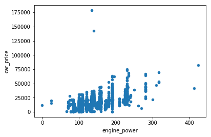


They are strongly correlated. we can see some outliers so we better drop those rows other wise they will effect our model performance.


```python
cars.loc[cars['car_price'] > 100000,'car_price'] = np.NaN
cars.dropna(subset = ['car_price'],axis = 0,inplace = True)

```

b.) car_price Vs mileage


```python
cars.plot(kind = 'scatter' , x = 'mileage', y = 'car_price')
```


    <matplotlib.axes._subplots.AxesSubplot at 0x24357897d30>


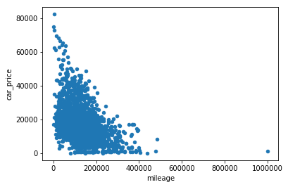


There is an outlier here as well so we better drop that row as well.


```python
cars.loc[cars['mileage'] > 800000,'mileage'] = np.NaN
cars.dropna(subset = ['mileage'], axis = 0, inplace = True)
cars.plot(kind = 'scatter' , x = 'mileage', y = 'car_price')
```


    <matplotlib.axes._subplots.AxesSubplot at 0x243575c5cc0>


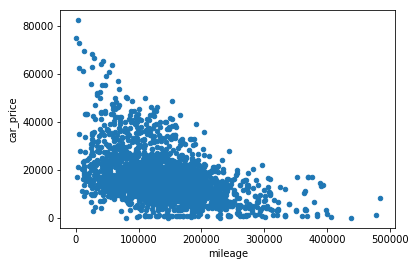


Looks like we have a strong negative correleation between car_price and mileage.

Idea : if any feature has most of the values same then it is not a strong feature and dropping it will not have any
effect on performance.


```python
f_list = ['feature1','feature2','feature3','feature4','feature5','feature6','feature7','feature8']
    
cars[f_list].sum()
```


    feature1    1868
    feature2    2696
    feature3     669
    feature4     665
    feature5    1550
    feature6     820
    feature7    3157
    feature8    1803
    dtype: int64


```python
cars.shape
```


    (3387, 19)


 Feature7 seems redundant as it contains 3157 True values out of 3387 so its redundant so we drop that column.


```python
cars.drop(columns = ['feature7'],axis = 1,inplace = True)
```

# Let's check out  fuel,car_paint_color,car_type columns

### Question_1: which is the most popular fuel type ?


```python
cars['fuel'].value_counts()
```


    diesel           3236
    petrol            142
    hybrid_petrol       6
    electro             3
    Name: fuel, dtype: int64


```python
cars['fuel'].value_counts().plot(kind = 'barh')
```


    <matplotlib.axes._subplots.AxesSubplot at 0x24358902278>


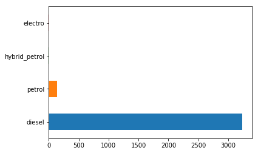


### Ans_1: 95% of the car fuel types are diesel.

---

### Question_2: which of the fuel type car is most expensive and which fuel type is lease expensive?


```python
mean_price_fuel = pd.pivot_table(cars, index = 'fuel' , values = 'car_price')
mean_price_fuel.sort_values(by= 'car_price',ascending  = False).plot(kind = 'barh')
```


    <matplotlib.axes._subplots.AxesSubplot at 0x24358946f28>


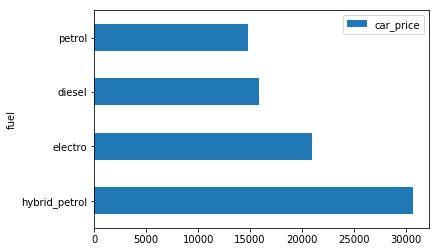


### Ans_2 : Hybrid_petrol fuel type car is the most expensive car and petrol fuel type is least expensive.

---

### Question_3 : Does colour of a car have any impact on the car_price?


```python
cars['car_paint_color'].value_counts()
```


    black     1152
    grey       794
    blue       505
    white      386
    silver     234
    brown      223
    red         38
    beige       36
    green       14
    orange       5
    Name: car_paint_color, dtype: int64


Yes, May be an odd coloured car like pink go for a lesser price than normal colours like black,grey e.t.c


```python
mean_colour_fuel = pd.pivot_table(cars, index = 'car_paint_color' , values = 'car_price')
mean_colour_fuel.sort_values(by= 'car_price',ascending  = False)
```


<div>
<style scoped>
    .dataframe tbody tr th:only-of-type {
        vertical-align: middle;
    }

    .dataframe tbody tr th {
        vertical-align: top;
    }

    .dataframe thead th {
        text-align: right;
    }
</style>
<table border="1" class="dataframe">
  <thead>
    <tr style="text-align: right;">
      <th></th>
      <th>car_price</th>
    </tr>
    <tr>
      <th>car_paint_color</th>
      <th></th>
    </tr>
  </thead>
  <tbody>
    <tr>
      <th>orange</th>
      <td>17980.000000</td>
    </tr>
    <tr>
      <th>white</th>
      <td>17579.792746</td>
    </tr>
    <tr>
      <th>red</th>
      <td>17018.421053</td>
    </tr>
    <tr>
      <th>black</th>
      <td>16258.940972</td>
    </tr>
    <tr>
      <th>brown</th>
      <td>15956.502242</td>
    </tr>
    <tr>
      <th>beige</th>
      <td>15380.555556</td>
    </tr>
    <tr>
      <th>grey</th>
      <td>15246.473552</td>
    </tr>
    <tr>
      <th>silver</th>
      <td>15164.957265</td>
    </tr>
    <tr>
      <th>blue</th>
      <td>14801.188119</td>
    </tr>
    <tr>
      <th>green</th>
      <td>5857.142857</td>
    </tr>
  </tbody>
</table>
</div>


### Ans_3: According to the data orange coloured car is most expensive and green colored car is least expensive.But color does not impact car price strongly. For e.g You have same car but with different colour.The prices vary very little.


---

### Question_4: Which car_type is most expensive and which is least on average?


```python
cars['car_type'].value_counts().plot('barh')
```


    <matplotlib.axes._subplots.AxesSubplot at 0x243589b55c0>


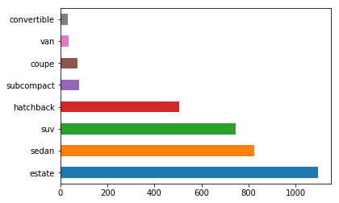


- Estate is the most popular car type!


```python
mean_car_type = pd.pivot_table(cars, index = 'car_type' , values = 'car_price')
mean_car_type.sort_values(by= 'car_price',ascending  = False).plot(kind = 'barh')
```


    <matplotlib.axes._subplots.AxesSubplot at 0x24358a1f0b8>


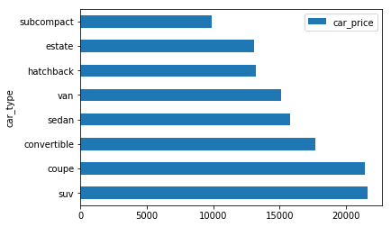


### Ans_4: On average an SUV costs most followed by coupe and convertible!

--- 

### Question_5: Which car model costs the highest on average


```python
mean_car_model = pd.pivot_table(cars, index = 'model_cat' , values = 'car_price')
mean_car_model.sort_values(by= 'car_price',ascending  = False).plot(kind = 'barh')
```


    <matplotlib.axes._subplots.AxesSubplot at 0x24358a85ac8>


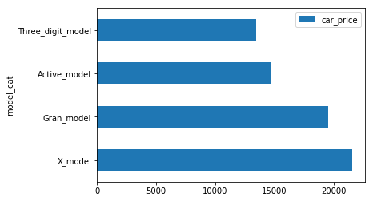


### Ans_5: On average X_model costs most followed by Gran_model and Active_model

--- 

### Question_6 : what is the age of most of the cars in the data?


```python
cars['age_simplified'].value_counts().plot(kind = 'barh')
```


    <matplotlib.axes._subplots.AxesSubplot at 0x24358aef080>


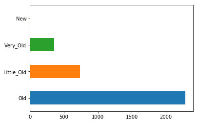


### Ans_6 : Most of cars age is "Old" (2-4)Years old.

--- 

### Question_7: What is the average price of each car_age category(New,little_old,old,very_old)


```python
mean_car_age_price = pd.pivot_table(cars, index = 'age_simplified' , values = 'car_price')
mean_car_age_price.sort_values(by= 'car_price',ascending  = False).plot(kind = 'barh')
```


    <matplotlib.axes._subplots.AxesSubplot at 0x24358b4b400>


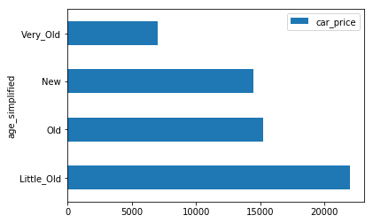


### Ans_7: On Averge a car that is 2-4 years old('Little_old') is the costs more and car which is greater than 8 years('Very_Old') costs least.

# 5. Data Modelling 

Machine can understand only numbers so we have to convert those categorical values to numerical values.

Let's convert columns with categorical values to numerical using One-hot encoding.


```python
dummy_df = pd.get_dummies(cars,columns = ['car_type','fuel','model_cat','feature1','feature2','feature3','feature4','feature5','feature6','feature8','age_simplified'])
```

we drop Non-numerical columns and prepare our data for modelling.


```python
model_df = dummy_df.drop(columns = ['car_paint_color','registration_date','sold_date','car_age_days'],axis = 1)
```


```python
Y = model_df['car_price']
X = model_df.drop(columns = ['car_price'],axis = 1)
```

Model_1: Linear Regression


```python
x_train, x_test, y_train, y_test = train_test_split(X, Y, test_size=0.15, random_state=1)
lm = LinearRegression()
lm.fit(x_train,y_train)

```


    LinearRegression(copy_X=True, fit_intercept=True, n_jobs=None,
             normalize=False)


# 6. Model Predictions(Linear Regression)


```python
Yhat=lm.predict(x_train)
Yhat[0:5] 
```


    array([ 8286.13664858,  9664.02544099,  -105.20664293, 19840.81099021,
            8873.92627532])


```python
lm.intercept_
```


    10923.621840784128


```python
lm.coef_
```


    array([-3.67349109e-02,  1.02146870e+02,  1.65871241e+03,  1.75460259e+03,
           -1.65086727e+03, -7.31009587e+02,  3.37988965e+02,  1.70358114e+02,
            2.11070429e+03, -3.65048950e+03, -2.59645044e+03,  1.70552976e+03,
            5.68106395e+03, -4.79014327e+03,  1.69875881e+02,  5.97291808e+02,
           -1.16496517e+03, -1.36577027e+03, -6.26211879e+02,  6.26211880e+02,
           -7.08832082e+02,  7.08832082e+02, -5.06294725e+02,  5.06294725e+02,
           -8.21398913e+02,  8.21398913e+02,  5.66280566e+01, -5.66280565e+01,
           -4.07230950e+02,  4.07230950e+02, -7.17344416e+02,  7.17344416e+02,
            4.29617895e+03, -1.40677487e+03,  9.77180712e+02, -3.86658480e+03])


```python
print('The R-square of train data is: ', lm.score(x_train, y_train))
```

    The R-square of train data is:  0.7456099370960487
    


```python
mse = mean_squared_error(y_train, Yhat)
print('The mean square error of price and predicted value is: ', mse)
```

    The mean square error of price and predicted value is:  18583009.992220502
    

# 7. Model Evaluation(Linear Regression)

Distribution plot between train data and predicted data


```python
plt.figure(figsize=(10, 12))


ax1 = sns.distplot(y_train, hist=False, color="r", label="Actual Value(Train)")
sns.distplot(Yhat, hist=False, color="b", label="Fitted Values(Train)" , ax=ax1)


plt.title('Actual vs Fitted Values for Price')
plt.xlabel('Price')
plt.ylabel('Proportion of Cars')

plt.show()
plt.close()
```

    C:\Users\Welcome\Anaconda3\lib\site-packages\scipy\stats\stats.py:1713: FutureWarning: Using a non-tuple sequence for multidimensional indexing is deprecated; use `arr[tuple(seq)]` instead of `arr[seq]`. In the future this will be interpreted as an array index, `arr[np.array(seq)]`, which will result either in an error or a different result.
      return np.add.reduce(sorted[indexer] * weights, axis=axis) / sumval
    


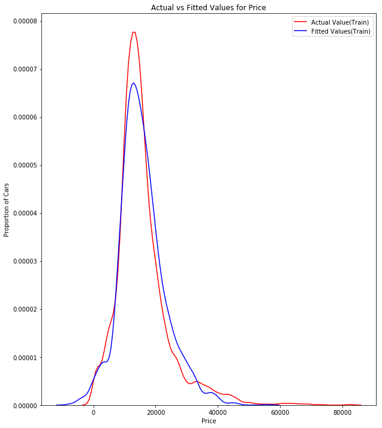


Distribution plot between test data and predicted data


```python
plt.figure(figsize=(10, 12))


ax2 = sns.distplot(y_test, hist=False, color="g", label="Actual Value(Test)")
sns.distplot(yhat_test, hist=False, color="m", label="Fitted Values(Test)", ax=ax2)


plt.title('Actual vs Fitted Values for Price(Test_data)')
plt.xlabel('Price')
plt.ylabel('Proportion of Cars')

plt.show()
plt.close()
```


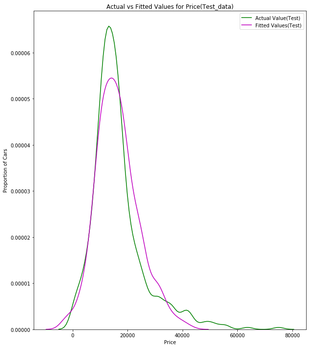


The predicted values are more than expected for higher prices and that pattern kept on going.

model_2 : polynomial regression


```python
lm_2 = LinearRegression()
pr = PolynomialFeatures(degree=2)
x_train_pr = pr.fit_transform(x_train)
x_test_pr = pr.fit_transform(x_test)    
lm_2.fit(x_train_pr, y_train)

print('The R-square for prediction on test data: ', lm_2.score(x_test_pr,y_test))
```

    The R-square for prediction on test data:  -48.24927413031234
    

R-squared value is negative which indicates the fit is actually worse than fitting a straight line so this is worse than linear regression.


model_3 : Ridge Regression


```python
pr=PolynomialFeatures(degree=2)
x_train_pr_ridge=pr.fit_transform(x_train)
x_test_pr_ridge=pr.fit_transform(x_test)
```


```python
RigeModel=Ridge(alpha=0.1)
RigeModel.fit(x_train_pr, y_train)
```

    C:\Users\Welcome\Anaconda3\lib\site-packages\sklearn\linear_model\ridge.py:125: LinAlgWarning: scipy.linalg.solve
    Ill-conditioned matrix detected. Result is not guaranteed to be accurate.
    Reciprocal condition number2.423100e-26
      overwrite_a=True).T
    


    Ridge(alpha=0.1, copy_X=True, fit_intercept=True, max_iter=None,
       normalize=False, random_state=None, solver='auto', tol=0.001)


# 6. Model Predictions(Ridge Regression)


```python
yhat_rid = RigeModel.predict(x_test_pr)
```


```python
pd.DataFrame(yhat_rid).to_csv("Predicted_Values.csv")
```


```python
RigeModel.score(x_test_pr_ridge, y_test)
```


    0.8301400022156428


```python
RigeModel.score(x_train_pr_ridge, y_train)
```


    0.8517594846848306


# 7.Model Evaluation(Ridge Regression)

Distribution plot between test data and predicted data


```python
plt.figure(figsize=(10, 12))


ax3 = sns.distplot(y_test, hist=False, color="g", label="Actual Value(Test)(Ridge_Regression)")
sns.distplot(yhat_rid, hist=False, color="m", label="Fitted Values(Test)(Ridge_Regression)", ax=ax3)


plt.title('Actual vs Fitted Values for Price(Test_data)')
plt.xlabel('Price')
plt.ylabel('Proportion of Cars')

plt.show()
plt.close()
```

    C:\Users\Welcome\Anaconda3\lib\site-packages\scipy\stats\stats.py:1713: FutureWarning: Using a non-tuple sequence for multidimensional indexing is deprecated; use `arr[tuple(seq)]` instead of `arr[seq]`. In the future this will be interpreted as an array index, `arr[np.array(seq)]`, which will result either in an error or a different result.
      return np.add.reduce(sorted[indexer] * weights, axis=axis) / sumval
    


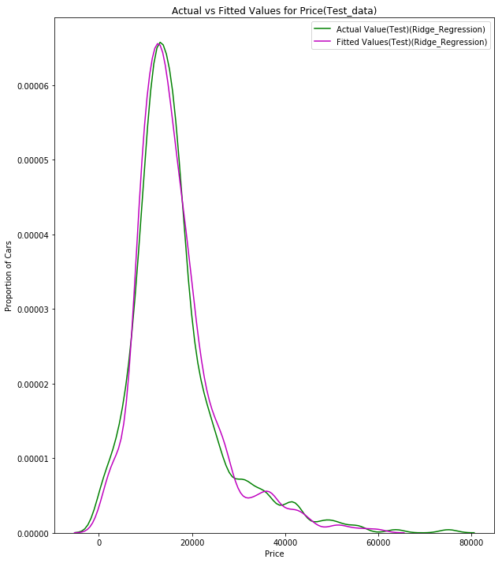


## Conclusion: Below figure is distribution of values predicted Vs Actual Values(Left-LinReg,Right-RidgeReg)

Linear Regression          |  Ridge Regression
:-------------------------:|:-------------------------:
  |  


```python

```
